# parking-control

**English** · [Português (Brasil)](README.pt-BR.md)

[](https://github.com/FabianoArthur/parking-control/actions/workflows/ci.yml)


[](LICENSE)

A REST API for running a parking lot: spots, reservations, check-in/check-out and
**time-based pricing** with a grace period, per-fraction charging and a daily cap. It's built with
Java 21 and Spring Boot 3 on PostgreSQL.

## Why it's interesting

It's a small domain with the problems real systems have:

- **Money without floating point.** Every amount is an integer number of cents, and the pricing
  rules live in one pure function covered by table-driven tests.
- **Time that doesn't lie.** Timestamps are `Instant`s stored as `timestamptz`. A stay is priced
  by elapsed time, so a daylight-saving change never adds or removes an hour from the bill (and
  there's a test for that). "Now" comes from an injected `Clock`, so tests can move time forward.
- **No double booking under concurrency.** Two gates checking in the same car at the same time
  can't both win: a `UNIQUE` key on the open plate stops it. Two cars racing for one spot can't
  both win either, thanks to optimistic locking with `@Version`. Reservations lock the spot row
  before checking for overlaps. There's an integration test that fires the requests in parallel.
- **Errors a client can handle.** Every error is an
  [RFC 7807](https://www.rfc-editor.org/rfc/rfc7807) `application/problem+json` body with a
  stable machine-readable `code` (`SPOT_OCCUPIED`, `PLATE_ALREADY_PARKED`, ...) and per-field
  validation messages.

## Demo

Interactive docs (Swagger UI) are served at `/swagger-ui.html`, and the OpenAPI spec at
`/v3/api-docs`:


A check-in/check-out round trip, with output captured from the Docker Compose stack:

```console
$ curl -s localhost:8080/api/v1/lots -H 'Content-Type: application/json' -d '{
    "name": "Downtown Garage",
    "pricing": {"gracePeriodMinutes": 15, "firstHourCents": 1000,
                "fractionMinutes": 30, "fractionCents": 300, "dailyCapCents": 6000}}'
{"id":"6d72c0a4-9105-45b7-8f8e-471c04342fd7","name":"Downtown Garage","pricing":{…},"createdAt":"…"}

$ curl -s "localhost:8080/api/v1/lots/$LOT/quote?entryAt=2026-03-02T08:00:00Z&exitAt=2026-03-02T10:40:00Z"
{"entryAt":"2026-03-02T08:00:00Z","exitAt":"2026-03-02T10:40:00Z","amountCents":2200}

$ curl -s localhost:8080/api/v1/lots/$LOT/sessions -H 'Content-Type: application/json' \
    -d '{"licensePlate": "abc-1d23", "spotType": "EV"}'
{"id":"946f469c-…","lotId":"6d72c0a4-…","spotCode":"E-01","licensePlate":"ABC1D23","reservationId":null,
 "entryAt":"2026-09-26T15:34:13.923Z","exitAt":null,"amountCents":null,"status":"OPEN"}

$ curl -s localhost:8080/api/v1/lots/$LOT/sessions -H 'Content-Type: application/json' \
    -d '{"licensePlate": "ABC1D23"}'
{"type":"about:blank","title":"Conflict","status":409,"detail":"ABC1D23 is already parked",
 "instance":"/api/v1/lots/6d72c0a4-…/sessions","code":"PLATE_ALREADY_PARKED"}

$ curl -s -X POST localhost:8080/api/v1/sessions/$SESSION/checkout
{"id":"946f469c-…","lotId":"6d72c0a4-…","spotCode":"E-01","licensePlate":"ABC1D23","reservationId":null,
 "entryAt":"2026-09-26T15:34:13.923Z","exitAt":"2026-09-26T15:34:14.313Z","amountCents":0,"status":"CLOSED"}
```

(The check-out above is free because the car left inside the 15-minute grace period.)

## Quick start

You need Docker. A JDK is only needed to run the app outside Docker.

```bash
cp .env.example .env                  # then set POSTGRES_PASSWORD
docker compose --profile app up -d --build
open http://localhost:8080/swagger-ui.html
```

To run from source against the Compose database:

```bash
docker compose up -d db               # PostgreSQL only
set -a; source .env; set +a
./mvnw spring-boot:run
```

Configuration comes only from environment variables (`DB_URL`, `DB_USERNAME`, `DB_PASSWORD`,
`PORT`). No credentials are committed.

## Architecture

<picture>
  <source media="(prefers-color-scheme: dark)" srcset="docs/assets/architecture-dark.svg">
  
</picture>

```
src/main/java/io/github/fabianoarthur/parking
├── common/       problem+json error handler, license plate value object, Clock and OpenAPI config
├── lot/          lots, pricing policy, availability and price quotes
├── spot/         spots (type, occupancy, optimistic lock)
├── reservation/  time-window reservations with overlap checks
├── session/      check-in / check-out
└── pricing/      PriceCalculator: a pure function with no Spring and no I/O
```

The schema is versioned with Flyway (`src/main/resources/db/migration`), and Hibernate only
validates it. The migration uses portable SQL, so the integration tests run the same schema on H2
in PostgreSQL mode.

### Pricing rules

| Rule | Example (15 min grace, R$ 10.00 first hour, R$ 3.00 per 30 min, R$ 60.00 cap) |
|---|---|
| A stay up to the grace period is free | 15 min → R$ 0.00 |
| Past the grace period, the first hour is charged in full | 16 min → R$ 10.00 |
| After the first hour, each **started** fraction is charged | 61 min → R$ 13.00 · 91 min → R$ 16.00 |
| Each 24 h block is capped at the daily cap | 10 h → R$ 60.00 |
| Multi-day stays: full days × cap + the remainder priced again (no second grace period) | 24 h 01 min → R$ 70.00 |

### Business rules

- A car can have only one open session. A spot holds one car at a time.
- A reservation must start in the future, lasts at most 24 h, and can't overlap another reservation
  on the same spot or another reservation by the same car in the same lot. Windows are half-open,
  so back-to-back reservations are fine.
- While a reservation is in effect, its spot is held for that car. At check-in, the car is sent to
  its reserved spot and the reservation becomes `FULFILLED`. Any other car gets `409 SPOT_RESERVED`.
- A reservation that has already started can't be cancelled. A reservation whose window has
  passed simply stops being in effect, with no background job.
- If a walk-in car is still parked on a spot when that spot's reservation starts, the reserved car
  gets `409 SPOT_OCCUPIED`. Handling that is left to the operator.
- Authentication and authorization are out of scope: put the API behind your gateway or add Spring
  Security before exposing it.

## API

| Method | Path | What it does |
|---|---|---|
| `POST` / `GET` | `/api/v1/lots` | create a lot / list lots (paged) |
| `GET` | `/api/v1/lots/{lotId}` | get a lot |
| `GET` | `/api/v1/lots/{lotId}/availability` | available / occupied / reserved spots right now, per type |
| `GET` | `/api/v1/lots/{lotId}/quote?entryAt=&exitAt=` | price a hypothetical stay |
| `POST` / `GET` | `/api/v1/lots/{lotId}/spots` | add a spot / list spots (`type`, `occupied` filters) |
| `POST` | `/api/v1/lots/{lotId}/reservations` | reserve a spot |
| `GET` / `DELETE` | `/api/v1/reservations/{id}` | get / cancel a reservation |
| `POST` | `/api/v1/lots/{lotId}/sessions` | check a car in (by `spotCode`, `spotType` or any free spot) |
| `POST` | `/api/v1/sessions/{id}/checkout` | check a car out and charge the stay |
| `GET` | `/api/v1/sessions/{id}` | get a session |

Lists are paged (`?page=0&size=20`, at most 100 per page). Timestamps must include an offset
(`2026-03-02T08:00:00Z`). A timestamp without one gets a `400`.

## Tests

```bash
./mvnw verify   # google-java-format check (Spotless) + all tests
```

- `PriceCalculatorTest`: table-driven pricing rules, boundaries, a DST change and policy
  validation.
- `LicensePlateTest`: normalization of the pre-2018 (`ABC1234`) and Mercosul (`ABC1D23`) formats.
- `ParkingFlowIT`: the whole HTTP flow through MockMvc on H2, with a controllable clock:
  reservations, conflicts, availability, problem+json errors, paging, and parallel check-ins racing
  for the same car and the same spot.

CI runs on every push and pull request: the build and tests, a Docker image build, and a
[gitleaks](https://github.com/gitleaks/gitleaks) scan of the full history and the working tree.

## Tech stack

Java 21 · Spring Boot 3.4 (Web, Data JPA, Validation, Actuator) · PostgreSQL 16 · Flyway ·
springdoc-openapi · JUnit 5, AssertJ, MockMvc, H2 · Spotless · Docker (multi-stage, non-root) ·
GitHub Actions

## License

[MIT](LICENSE) © 2026 Fabiano Arthur
