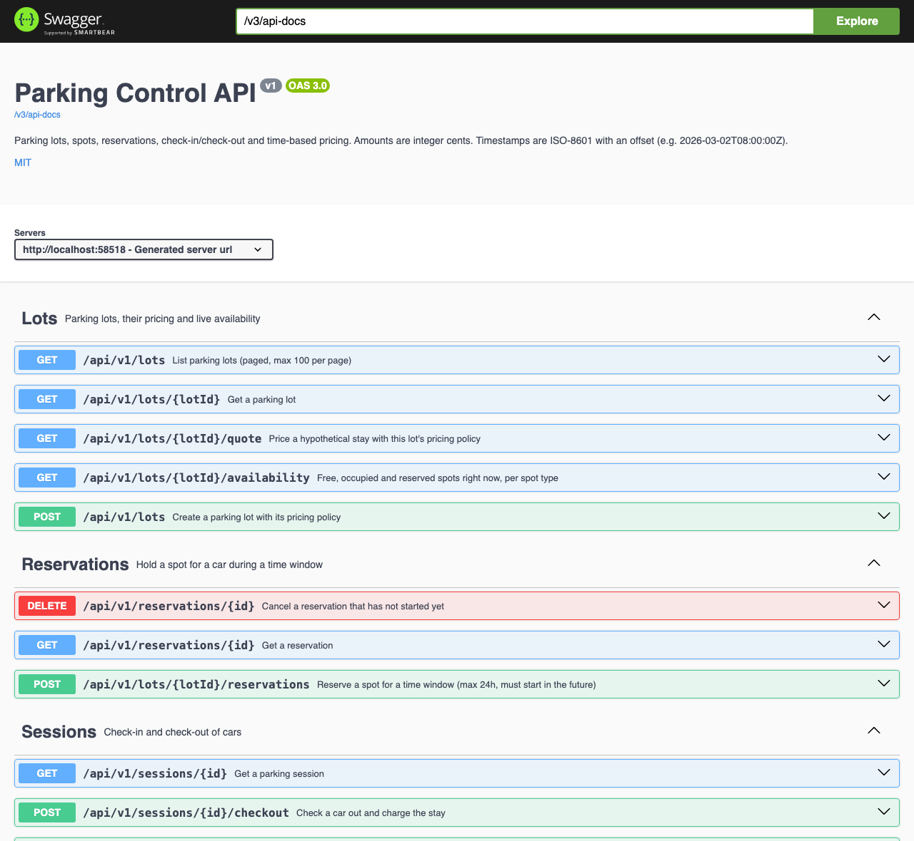

# parking-control

[English](README.md) · **Português (Brasil)**

[](https://github.com/FabianoArthur/parking-control/actions/workflows/ci.yml)


[](LICENSE)

API REST para operar um estacionamento: vagas, reservas, entrada/saída e **tarifação por tempo**
com tolerância, cobrança por fração e teto diário. Feita com Java 21 e Spring Boot 3 sobre
PostgreSQL.

## Por que é interessante

É um domínio pequeno com os problemas que sistemas reais têm:

- **Dinheiro sem ponto flutuante.** Todo valor é um número inteiro de centavos, e as regras de
  preço ficam numa única função pura coberta por testes em tabela.
- **Tempo que não mente.** Horários são `Instant`s gravados como `timestamptz`. A estadia é cobrada
  pelo tempo decorrido, então uma troca de horário de verão nunca soma nem tira uma hora da conta
  (e há teste para isso). O "agora" vem de um `Clock` injetado, então os testes podem avançar o
  tempo.
- **Nada de vaga dupla sob concorrência.** Duas cancelas registrando a entrada do mesmo carro ao
  mesmo tempo não passam as duas: uma chave `UNIQUE` na placa com sessão aberta impede. Dois carros
  disputando a mesma vaga também não, graças ao lock otimista com `@Version`. Reservas travam a
  linha da vaga antes de checar sobreposição. Há um teste de integração que dispara as requisições
  em paralelo.
- **Erros que o cliente consegue tratar.** Todo erro é um corpo
  [RFC 7807](https://www.rfc-editor.org/rfc/rfc7807) `application/problem+json` com um `code`
  estável e legível por máquina (`SPOT_OCCUPIED`, `PLATE_ALREADY_PARKED`, ...) e mensagens de
  validação por campo.

## Demonstração

A documentação interativa (Swagger UI) fica em `/swagger-ui.html`, e a especificação OpenAPI em
`/v3/api-docs`:



Uma ida e volta de entrada e saída, com a saída capturada da stack do Docker Compose:

```console
$ curl -s localhost:8080/api/v1/lots -H 'Content-Type: application/json' -d '{
    "name": "Downtown Garage",
    "pricing": {"gracePeriodMinutes": 15, "firstHourCents": 1000,
                "fractionMinutes": 30, "fractionCents": 300, "dailyCapCents": 6000}}'
{"id":"6d72c0a4-9105-45b7-8f8e-471c04342fd7","name":"Downtown Garage","pricing":{…},"createdAt":"…"}

$ curl -s "localhost:8080/api/v1/lots/$LOT/quote?entryAt=2026-03-02T08:00:00Z&exitAt=2026-03-02T10:40:00Z"
{"entryAt":"2026-03-02T08:00:00Z","exitAt":"2026-03-02T10:40:00Z","amountCents":2200}

$ curl -s localhost:8080/api/v1/lots/$LOT/sessions -H 'Content-Type: application/json' \
    -d '{"licensePlate": "abc-1d23", "spotType": "EV"}'
{"id":"946f469c-…","lotId":"6d72c0a4-…","spotCode":"E-01","licensePlate":"ABC1D23","reservationId":null,
 "entryAt":"2026-09-26T15:34:13.923Z","exitAt":null,"amountCents":null,"status":"OPEN"}

$ curl -s localhost:8080/api/v1/lots/$LOT/sessions -H 'Content-Type: application/json' \
    -d '{"licensePlate": "ABC1D23"}'
{"type":"about:blank","title":"Conflict","status":409,"detail":"ABC1D23 is already parked",
 "instance":"/api/v1/lots/6d72c0a4-…/sessions","code":"PLATE_ALREADY_PARKED"}

$ curl -s -X POST localhost:8080/api/v1/sessions/$SESSION/checkout
{"id":"946f469c-…","lotId":"6d72c0a4-…","spotCode":"E-01","licensePlate":"ABC1D23","reservationId":null,
 "entryAt":"2026-09-26T15:34:13.923Z","exitAt":"2026-09-26T15:34:14.313Z","amountCents":0,"status":"CLOSED"}
```

(A saída acima sai de graça porque o carro deixou a vaga dentro dos 15 minutos de tolerância.)

## Como rodar

Você precisa de Docker. JDK só é necessário para rodar a aplicação fora do Docker.

```bash
cp .env.example .env                  # depois defina POSTGRES_PASSWORD
docker compose --profile app up -d --build
open http://localhost:8080/swagger-ui.html
```

Para rodar a partir do código-fonte contra o banco do Compose:

```bash
docker compose up -d db               # só o PostgreSQL
set -a; source .env; set +a
./mvnw spring-boot:run
```

A configuração vem só de variáveis de ambiente (`DB_URL`, `DB_USERNAME`, `DB_PASSWORD`, `PORT`).
Nenhuma credencial fica no repositório.

## Arquitetura

<picture>
  <source media="(prefers-color-scheme: dark)" srcset="docs/assets/architecture.pt-BR-dark.svg">
  
</picture>

```
src/main/java/io/github/fabianoarthur/parking
├── common/       tratamento de erros problem+json, objeto de valor placa, config de Clock e OpenAPI
├── lot/          estacionamentos, política de preço, disponibilidade e cotação
├── spot/         vagas (tipo, ocupação, lock otimista)
├── reservation/  reservas por janela de tempo com checagem de sobreposição
├── session/      entrada / saída
└── pricing/      PriceCalculator: uma função pura, sem Spring e sem I/O
```

O schema é versionado com Flyway (`src/main/resources/db/migration`), e o Hibernate só o valida.
A migração usa SQL portável, então os testes de integração rodam o mesmo schema no H2 em modo
PostgreSQL.

### Regras de preço

| Regra | Exemplo (15 min de tolerância, R$ 10,00 a 1ª hora, R$ 3,00 a cada 30 min, teto de R$ 60,00) |
|---|---|
| Estadia até a tolerância é grátis | 15 min → R$ 0,00 |
| Passou da tolerância, a primeira hora é cobrada inteira | 16 min → R$ 10,00 |
| Depois da primeira hora, cobra-se cada fração **iniciada** | 61 min → R$ 13,00 · 91 min → R$ 16,00 |
| Cada bloco de 24 h é limitado ao teto diário | 10 h → R$ 60,00 |
| Vários dias: dias completos × teto + o restante cobrado de novo (sem segunda tolerância) | 24 h 01 min → R$ 70,00 |

### Regras de negócio

- Um carro só pode ter uma sessão aberta. Uma vaga comporta um carro por vez.
- A reserva precisa começar no futuro, dura no máximo 24 h e não pode se sobrepor a outra reserva
  da mesma vaga nem a outra reserva do mesmo carro no mesmo estacionamento. As janelas são
  semiabertas, então reservas encostadas são permitidas.
- Enquanto a reserva está em vigor, a vaga fica guardada para aquele carro. Na entrada, o carro vai
  para a vaga reservada e a reserva vira `FULFILLED`. Qualquer outro carro recebe
  `409 SPOT_RESERVED`.
- Reserva que já começou não pode ser cancelada. Reserva cuja janela já passou simplesmente deixa
  de valer, sem job em segundo plano.
- Se um carro avulso ainda estiver numa vaga quando a reserva dela começar, o carro reservado
  recebe `409 SPOT_OCCUPIED`. Resolver isso fica com o operador.
- Autenticação e autorização estão fora do escopo: coloque a API atrás do seu gateway ou adicione
  Spring Security antes de expô-la.

## API

| Método | Caminho | O que faz |
|---|---|---|
| `POST` / `GET` | `/api/v1/lots` | cria um estacionamento / lista (paginado) |
| `GET` | `/api/v1/lots/{lotId}` | busca um estacionamento |
| `GET` | `/api/v1/lots/{lotId}/availability` | vagas disponíveis / ocupadas / reservadas agora, por tipo |
| `GET` | `/api/v1/lots/{lotId}/quote?entryAt=&exitAt=` | cota uma estadia hipotética |
| `POST` / `GET` | `/api/v1/lots/{lotId}/spots` | adiciona vaga / lista vagas (filtros `type`, `occupied`) |
| `POST` | `/api/v1/lots/{lotId}/reservations` | reserva uma vaga |
| `GET` / `DELETE` | `/api/v1/reservations/{id}` | busca / cancela uma reserva |
| `POST` | `/api/v1/lots/{lotId}/sessions` | registra a entrada (por `spotCode`, `spotType` ou qualquer vaga livre) |
| `POST` | `/api/v1/sessions/{id}/checkout` | registra a saída e cobra a estadia |
| `GET` | `/api/v1/sessions/{id}` | busca uma sessão |

Listas são paginadas (`?page=0&size=20`, no máximo 100 por página). Horários precisam de fuso
(`2026-03-02T08:00:00Z`). Um horário sem fuso recebe `400`.

## Testes

```bash
./mvnw verify   # checagem de formatação google-java-format (Spotless) + todos os testes
```

- `PriceCalculatorTest`: regras de preço em tabela, limites, troca de horário de verão e
  validação da política.
- `LicensePlateTest`: normalização dos formatos antigo (`ABC1234`) e Mercosul (`ABC1D23`).
- `ParkingFlowIT`: o fluxo HTTP completo via MockMvc no H2, com relógio controlável: reservas,
  conflitos, disponibilidade, erros problem+json, paginação e entradas em paralelo disputando o
  mesmo carro e a mesma vaga.

A CI roda a cada push e pull request: build e testes, build da imagem Docker e varredura do
[gitleaks](https://github.com/gitleaks/gitleaks) no histórico completo e na árvore de trabalho.

## Stack

Java 21 · Spring Boot 3.4 (Web, Data JPA, Validation, Actuator) · PostgreSQL 16 · Flyway ·
springdoc-openapi · JUnit 5, AssertJ, MockMvc, H2 · Spotless · Docker (multi-stage, sem root) ·
GitHub Actions

## Licença

[MIT](LICENSE) © 2026 Fabiano Arthur
